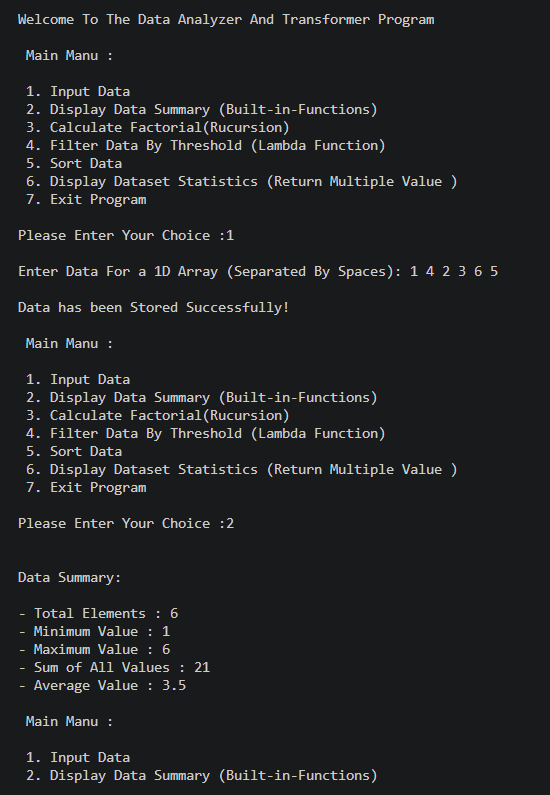

# 👩‍💻 Author

**Drashti Vadukul**

BCA Student | Learning Python, AI, ML & Data Science

# Data Analyzer And Transformer Program

## Description

The Data Analyzer And Transformer Program is a Python-based console application that allows users to enter, analyze, filter, sort, and transform numerical data.

This project demonstrates various Python programming concepts and functions such as:

- Built-in Functions
- User-Defined Functions
- `*args` and `**kwargs`
- `__doc__`
- Lambda Functions
- Recursion
- Global Variables
- Multiple Return Values
- Sorting and Filtering
- 1D and 2D Lists

## Objective

The main objective of this project is to analyze and transform data in different ways using a menu-driven Python program.

The program allows the user to:

- Enter numerical data
- Display data summary
- Calculate factorial using recursion
- Filter data using a lambda function
- Sort data in ascending or descending order
- Display dataset statistics

## Features

### 1. Input Data

The user can enter numerical values for a 1D array.

Example:

Enter Data For a 1D Array (Separated By Spaces):

12 21 34 56 78 90

The entered data is stored successfully for further operations.

### 2. Display Data Summary

The program displays basic information about the entered data using Python built-in functions.

Built-in functions used:

- `len()`
- `min()`
- `max()`
- `sum()`

The program also calculates the average value of the dataset.

### 3. Calculate Factorial

The program calculates the factorial of a number using recursion.

Example:

Enter a Number to Calculate Its Factorial: 5

Factorial of 5 is: 120

### 4. Filter Data By Threshold

The program uses a lambda function with the `filter()` function to filter values according to a given threshold.

Example:

Enter a threshold value: 50

Filtered Data (values >= 50):

56, 78, 90

### 5. Sort Data

The program allows the user to sort the entered data.

Sorting options:

1. Ascending
2. Descending

Example:

Sorted Data in Ascending Order:

12, 21, 34, 56, 78, 90

### 6. Display Dataset Statistics

The program displays important statistics of the dataset.

It includes:

- Minimum Value
- Maximum Value
- Sum of Values
- Average Value

This feature demonstrates returning multiple values from a function.

## Python Concepts Used

This project demonstrates the following Python concepts:

- Variables
- Lists
- User Input
- Conditional Statements
- Loops
- Functions
- Built-in Functions
- User-Defined Functions
- Lambda Functions
- Recursion
- `filter()`
- Sorting
- Multiple Return Values
- Global Variables
- `*args`
- `**kwargs`
- `__doc__`

## Main Menu

Welcome to the Data Analyzer and Transformer Program

Main Menu:

1. Input Data
2. Display Data Summary (Built-in Functions)
3. Calculate Factorial (Recursion)
4. Filter Data By Threshold (Lambda Function)
5. Sort Data
6. Display Dataset Statistics (Return Multiple Values)
7. Exit Program

## Example Operations

The program performs the following operations:

- Enter and store a dataset
- Find the minimum value
- Find the maximum value
- Calculate the sum of values
- Calculate the average
- Calculate factorial using recursion
- Filter data using a lambda function
- Sort data in ascending order
- Sort data in descending order
- Display complete dataset statistics

## Sample Output

### Step 1: Input Data

Please enter your choice: 1

Enter Data For a 1D Array (Separated By Spaces):

14 12 56 78 42 21 80

Data has been stored successfully!

### Step 2: Display Data Summary

Please enter your choice: 2

Data Summary:

Total Values: 7
Minimum Value: 12
Maximum Value: 80
Sum of all values: 303
Average value: 43.28

### Step 3: Calculate Factorial

Please enter your choice: 3

Enter a Number to Calculate Its Factorial: 5

Factorial of 5 is: 120

### Step 4: Filter Data By Threshold

Please enter your choice: 4

Enter a threshold value: 50

Filtered Data (values >= 50):

56, 78, 80

### Step 5: Sort Data

Please enter your choice: 5

Choose sorting option:

1. Ascending
2. Descending

Enter your choice: 1

Sorted Data in Ascending Order:

12, 14, 21, 42, 56, 78, 80

### Step 6: Display Dataset Statistics

Please enter your choice: 6

Dataset Statistics:

Minimum Value: 12
Maximum Value: 80
Sum of all values: 303
Average Value: 43.28

## Project Structure

Data-Analyzer-And-Transformer/
│
├── Data_Analyzer.py
├── README.md
└── output.png
    

## How to Run

### Step 1: Clone the Repository

git clone <your-repository-link>

### Step 2: Open the Project Folder

cd Data-Analyzer-And-Transformer

### Step 3: Run the Python Program

python Data_Analyzer.py

## Technologies Used

- Python
- Visual Studio Code
- Git
- GitHub

## Learning Outcome

Through this project, I learned and practiced:

- Creating and using functions
- Working with lists
- Using Python built-in functions
- Implementing recursion
- Using lambda functions
- Filtering and sorting data
- Returning multiple values from functions
- Creating a menu-driven Python program
- Using Git and GitHub for project management

## Data Flow & Program Architecture

┌─────────────────────────────────────────┐
               │             Program Start               │
               └────────────────────┬────────────────────┘
                                    │
                                    ▼
               ┌─────────────────────────────────────────┐
               │        Initialize Empty Array           │
               │               arry = []                 │
               └────────────────────┬────────────────────┘
                                    │
                                    ▼
┌────────────────────────────────────────────────────────────────────────┐
│                        MAIN MENU LOOP (while True)                     │
├───────┬───────────┬────────────┬─────────────┬───────────┬─────────────┤
│   1   │     2     │     3      │      4      │     5     │      6      │
▼       ▼           ▼            ▼             ▼           ▼             ▼
Input   Data     Factorial    Filter Data    Sort Data  Dataset       Exit
Data   Summary  (Recursion)    (Lambda)      (Asc/Desc) Statistics   Program
│       │           │            │             │           │             │
└───────┴───────────┴────────────┴─────────────┴───────────┴─────────────┤
                                                                         │
                                                                         ▼
                                                               ┌──────────────────┐
                                                               │  Terminate Loop  │
                                                               └──────────────────┘

## Conclusion

The Data Analyzer And Transformer Program is a simple Python project designed to demonstrate fundamental programming concepts through practical data analysis and transformation operations.

This project helped me strengthen my understanding of Python functions, lists, recursion, lambda functions, built-in functions, filtering, sorting, and GitHub project management.

